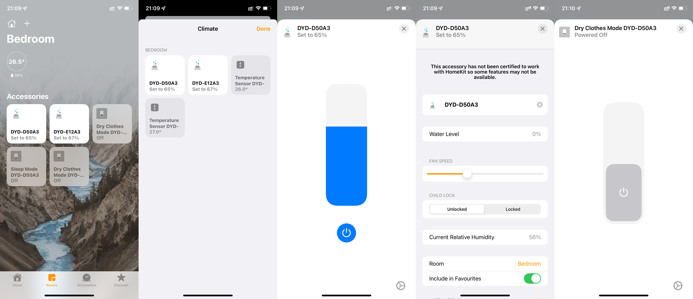

# Homebridge Deye

[](https://www.npmjs.com/package/homebridge-deye)[](https://github.com/IcesandSora/homebridge-deye/blob/master/LICENSE)

Connects the Deye dehumidifier to HomeKit and allows control via the native iOS Home App and Siri. This plug-in theoretically supports most Deye dehumidifiers.

[中文说明](https://github.com/IcesandSora/homebridge-deye/blob/master/README/zh-CN.md) ｜ English

## Function

- Access to HomeKit as a dehumidifier device

- Ambient temperature and humidity display

- Dehumidifier water level display

- Dehumidifier target humidity adjustment

- Set the mode of dehumidifier. Sleep, Manual and Dry

- Control fan speed (some models do not support this function)

- Child lock (physical control lock)

- HomeKit Automation

## Supported devices

Theoretically, most Deye dehumidifiers can be connected.

The following devices have been tested.

- Deye DYD-D50A3 (Touch Panel version) [Link](http://www.deye.cn/new/2020/04/14/%E5%AE%B6%E7%94%A8%E9%99%A4%E6%B9%BF%E6%9C%BAdyd-d50a3/)

- Deye DYD-E12A3 [Link](http://www.deye.cn/new/2020/04/15/%e5%ae%b6%e7%94%a8%e9%99%a4%e6%b9%bf%e6%9c%badyd-e12a3/)

## Screenshot

<center class="half">
    
</center>

## Installation

If you are new to Homebridge, please follow [the documentation here](https://github.com/homebridge/homebridge/wiki) to complete the installation of Homebridge and Homebridge Config UI X.

Installing the Dehumidifier plugin

```
sudo npm install -g homebridge-deye
```

## Configure

This plugin can be configured in Homebridge Config UI X, or manually.

Add the `DEYE` platform to `config.json` in the home directory within `.homebridge`.

Example configuration

```
{
    "`platforms`: [
        {
            "platform": "DEYE"
            "mqttBaseInfo": {
                "mqttHost": "yourmqtthost.com",
                "mqttPort": "1883",
                "endPoint": "b374fbd89bba44b28399d975fc82d8f5",
                "username": "b374fbd89bba44b28399d975fc82d8f5/9c2056e3f115459e9c88394217ee52fc",
                "password": "9c2056e3f115459e",
                "clientId": "app_34bc46389bc011ecb9090242ac120002"
            },
            "devices": [
                {
                    "name": "DYD-D50A3",
                    "model": "DYD-D50A3",
                    "productId": "97e85d3856c54a1ab090c8541101a050",
                    "deviceId": "5111127c8d6f4beca10861dfc5942949",
                    "fanControl": true,
                    "temperatureSensor": true,
                    "dryClothes": true,
                    "sleepMode": true
                }
            ]
        }
    ]
}
```

### Platform configuration field

`platform` [Required] should be "DEYE".

### Server connection configuration field `mqttBaseInfo`

`mqttHost` [Required] The address of the MQTT server.

`mqttPort` [Required] MQTT server port.

`endPoint` [Required] MQTT endPoint.

`username` [required] MQTT username.

`password` [required] MQTT password.

`clientId` [Required] MQTT client ID.

### Device connection configuration fields `devices`

`name` [required] The name of the custom accessory.

`model` [Required] The device model. For example `DYD-D50A3`

`productId` [required] The productId you got.

`deviceId` [required] The deviceId you got.

`fanControl` [Required] Whether to enable the wind speed control function. Only supported by some models.

`temperatureSensor` [Required] Whether to enable the temperature sensor. May only be supported by some models.

**Please note: When the temperature sensor is enabled, it will merge the accessories due to Apple HomeKit policy and you may not be able to see the humidifier control interface directly.**

If this happens, tap the "Accessories" option in the Home App under Accessories and you will see information about the dehumidifier.
Alternatively, you can choose to enable DryClothes mode or Sleep mode, and then click on "Show as separate panel" in Accessories in the Home App.

`dryClothes` [Required] Whether to enable the dry mode switch. May only be supported by some models.

`sleepMode` [Required] Whether to enable the sleep mode switch. May only be supported by some models.

## Special thanks

[@yamisenyuki](https://github.com/yamisenyuki) - Writing the code

[HAP-NodeJS](https://github.com/KhaosT/HAP-NodeJS) and [homebridge](https://github.com/nfarina/homebridge) - for making this possible.